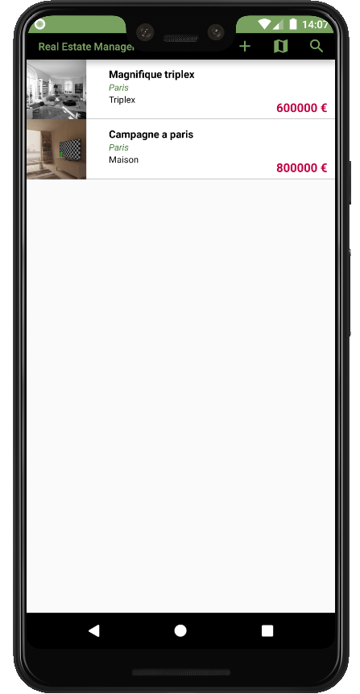
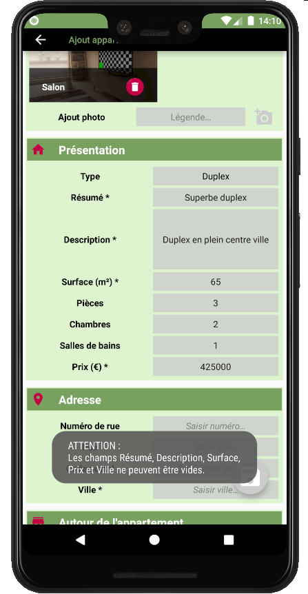
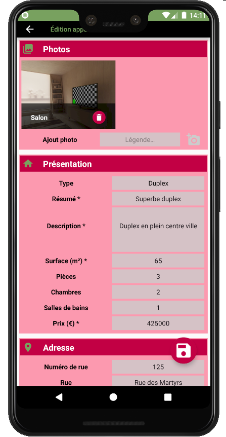
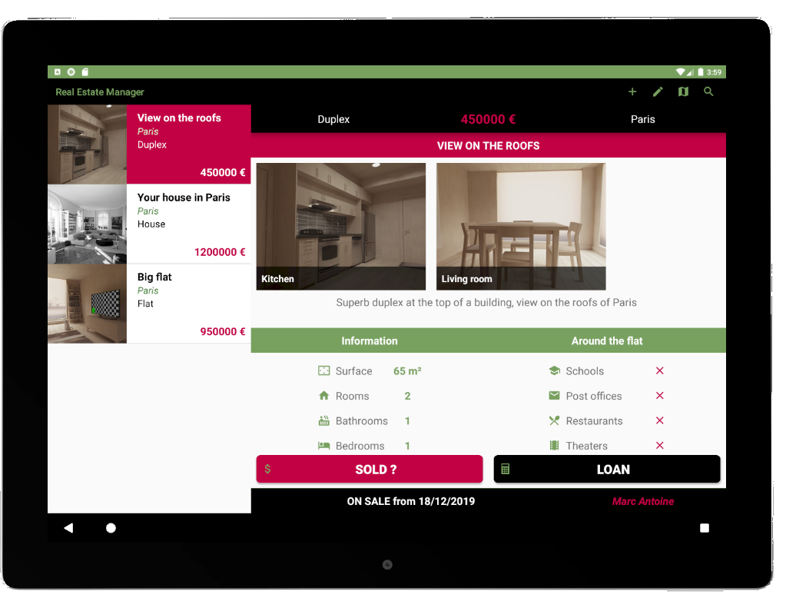

<h1>RealEstateManager</h1>
This app has been realized for a training purpose. 
Its goal is to allow you to add houses to your list and manage them. 

<h1>Screenshots</h1>

<h1>Motivation</h1>
This app was part of the mandatory app to realize to achieve the training. 

<h1>Features</h1>
This app allows you to :
- see the current list of flat available and previously sold
- see them on a map
- filtering the list following different criterias
- add a new item
- edit an item
- set an item as sold
- calculate a loan for a specific item

2 langages available : english/french

<h1>How to use the app ?</h1>

**Navigate among the different views** :
- click map to see a map of the registered flats (you can click them to have a short description)
- click a description on the map or an item in the list to get a detailed view
- in the detailed view, click Sold to have the flat seen as sold (it will appear at the end of the list now)
 

**Edit view**  :
- in the detail view, click on the edit button to edit the item
- you can remove / add pictures, edit fields
 

**Filter list**  :
- click on the magnifying glass
- choose the criteria you want to meet
- click the tick to see the results
- click the "Back to the full list" button to go back to the full list
 

<h1>Technical considerations</h1>
These libraries have been used to develop this app : 
EasyPermission :         implementation 'pub.devrel:easypermissions:1.1.1' 
Butterknife :         implementation 'com.jakewharton:butterknife:10.1.0'
                      annotationProcessor 'com.jakewharton:butterknife-compiler:10.1.0' 
JustifyText :     implementation 'me.biubiubiu.justifytext:library:1.1' 
CrystalRangeSeekBar :  implementation 'com.crystal:crystalrangeseekbar:1.1.3' 
Room has been used to save/store data.

<h1>Credits</h1>
Bertrand Ripoche
